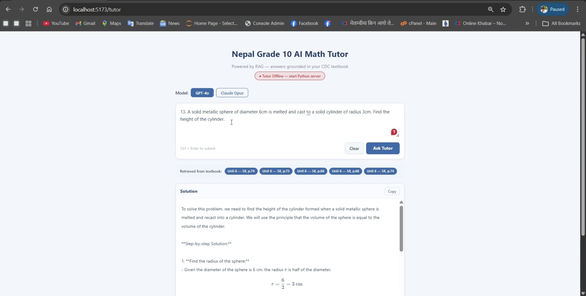

# Multimodal and Agentic RAG for Grade 10 Mathematics Tutoring in the Nepalese Curriculum

A research project investigating the effectiveness of Retrieval-Augmented Generation (RAG), multimodal retrieval, and agentic workflows for curriculum-aligned mathematics tutoring for Nepal Grade 10 (SEE) students.

---

# Abstract

This project investigates whether Retrieval-Augmented Generation (RAG) can improve the quality of AI-generated step-by-step mathematics tutoring aligned with the Nepal Grade 10 curriculum.

The system integrates:
- Curriculum-aligned textbook retrieval
- Multimodal retrieval using diagram descriptions and CLIP embeddings
- Agentic RAG workflows including Self-RAG and CRAG
- OCR-based image question processing
- Human evaluation by teachers and students

Four experiments were conducted comparing:
- Multiple LLMs
- Retrieval strategies
- Agentic workflows
- Human evaluation metrics

The results show that:

- **Claude Opus + Static RAG** achieves the highest step correctness (**0.958**)
- **Text-only retrieval** consistently outperforms multimodal retrieval
- **Agentic workflows increase latency** without consistent quality gains
- Simpler architectures outperform more complex pipelines for this curriculum-aligned task

---

# Research Questions

## RQ1 — Model Comparison
Which LLM produces the most accurate and structured step-by-step solutions for Nepal Grade 10 mathematics?

## RQ2 — Retrieval Strategy
Which retrieval strategy provides the best textbook context for solution generation?

## RQ3 — Agentic Workflows
Do agentic workflows improve performance over standard static RAG pipelines?

## RQ4 — Human Evaluation
Do teachers and students perceive RAG-generated solutions as better than baseline solutions?

---

# Dataset

The dataset is constructed from the official Nepal Grade 10 Mathematics textbook.

## Contents
- Full textbook chapter text
- Worked examples
- Exercise questions
- Diagram images
- OCR extracted content
- GPT-4V generated diagram descriptions

## Dataset Statistics

| Component | Count |
|---|---|
| Textbook Pages | ~279 |
| Chapters | 18 |
| Extracted Diagrams | ~150 |
| Test Questions | 100+ |

## Question Distribution

| Type | Count |
|---|---|
| Easy | 33 |
| Medium | 34 |
| Hard | 33 |

| Category | Count |
|---|---|
| Computational | 40 |
| Conceptual | 35 |
| Proof-based | 25 |

---

# Project Structure

```text
project/
├── config.py
├── data/
│   ├── textbook_chunks.json
│   ├── diagrams/
│   ├── image_descriptions.json
│   └── test_set.json
│
├── experiments/
│   ├── experiment1_model_comparison.py
│   ├── experiment2_retrieval_comparison.py
│   ├── experiment3_agentic_workflows.py
│   └── experiment4_human_evaluation.py
│
├── results/
│   ├── experiment1/
│   ├── experiment2/
│   ├── experiment3/
│   └── human_eval/
│
├── rag/
│   ├── retrieval.py
│   ├── embeddings.py
│   ├── workflows.py
│   ├── prompts.py
│   └── generation.py
│
├── eval-app/
│   ├── backend/
│   └── frontend/
│
└── README.md
```

---

# System Architecture

The system follows a Retrieval-Augmented Generation (RAG) architecture consisting of four layers.

## 1. Input Processing Layer
- Text queries
- OCR processing for image questions
- Image preprocessing

## 2. Retrieval Layer
- Sentence-BERT embeddings
- ChromaDB vector search
- Multimodal embedding fusion
- Top-k textbook retrieval

## 3. Workflow Layer
- Static RAG
- Self-RAG
- CRAG
- Adaptive RAG (experimental)

## 4. Generation Layer
- Claude Opus
- GPT-4o
- Gemini 2.5 Flash
- Qwen2-Math

---

# Data Preprocessing Pipeline

## Stage 1 — Image Extraction
- Extract diagrams using PyMuPDF
- Store metadata (page number, position)

## Stage 2 — Diagram Description
- Use GPT-4V to generate structured descriptions
- Capture labels, measurements, geometry relationships

## Stage 3 — Image-Example Linking
- Link diagrams to worked examples
- Use semantic similarity + page proximity

## Stage 4 — Embedding Construction

### Text Embeddings
- Sentence-BERT (768 dimensions)

### Multimodal Embeddings
Combined:
- Text embeddings
- Diagram description embeddings
- CLIP image embeddings

Final vector size:
- **2048 dimensions**

## Stage 5 — Test Set Construction
- Stratified sampling
- Balanced across:
  - difficulty
  - question types
  - visual dependency

---

# Experiment 1 — Model Comparison

## Objective
Compare multiple LLMs using a standard Static RAG pipeline.

## Models Evaluated
- Claude Opus
- GPT-4o
- Qwen2-Math
- Gemini 2.5 Flash

## Setup
- Static RAG
- Text-only retrieval
- Top-5 retrieved passages
- 20 questions per configuration

---

## Experiment 1A — Baseline (No RAG)

| Model | BLEU | ROUGE-L | BERTScore | Step Correctness | Latency |
|---|---|---|---|---|---|
| Claude Opus | 0.0208 | 0.1055 | 0.6917 | 0.9600 | 10.4s |
| GPT-4o | 0.0290 | 0.1174 | 0.7029 | 0.8625 | 5.1s |
| Qwen2-Math | 0.0208 | 0.0950 | 0.6947 | 0.9025 | 16.2s |
| Gemini 2.5 Flash | 0.0792 | 0.1757 | 0.7316 | 0.2300 | 6.0s |

---

## Experiment 1B — Static RAG

| Model | BLEU | ROUGE-L | BERTScore | Step Correctness | Latency |
|---|---|---|---|---|---|
| Claude Opus | 0.0237 | 0.1142 | 0.7022 | 0.9500 | 11.3s |
| GPT-4o | 0.0324 | 0.1167 | 0.6989 | 0.8700 | 5.4s |
| Qwen2-Math | 0.0138 | 0.0916 | 0.6826 | 0.9075 | 18.2s |
| Gemini 2.5 Flash | 0.0636 | 0.1730 | 0.7348 | 0.2950 | 5.7s |

---

## Key Findings

### Claude Opus performs best overall
Claude Opus achieves the highest step correctness and produces the most structured curriculum-aligned solutions.

### GPT-4o offers the best quality-latency tradeoff
GPT-4o performs competitively while maintaining low latency.

### Gemini scores high semantically but poorly structurally
Gemini achieves high BLEU/ROUGE/BERT scores but low step correctness.

### Qwen2-Math does not benefit from RAG
External curriculum retrieval appears to interfere with internal mathematical reasoning.

---

# Experiment 2 — Retrieval Strategy Comparison

## Objective
Compare text-only and multimodal retrieval strategies.

## Fixed Model
- GPT-4o

## Retrieval Conditions
1. Text Only
2. Text + Diagram Description
3. Text + Description + CLIP (Equal Weights)
4. Text + Description + CLIP (Learned Weights)

---

## Results

| Condition | BLEU | ROUGE-L | BERTScore | Step Correctness | Similarity | Latency |
|---|---|---|---|---|---|---|
| Text Only | 0.0475 | 0.1684 | 0.7180 | 0.8903 | 0.642 | 5.8s |
| Text + Desc | 0.0482 | 0.1612 | 0.7197 | 0.8710 | 0.540 | 5.6s |
| Text + Desc + CLIP | 0.0419 | 0.1513 | 0.7194 | 0.8710 | 0.540 | 5.9s |
| Learned Fusion | 0.0468 | 0.1585 | 0.7255 | 0.8097 | 0.526 | 5.8s |

---

## Key Findings

### Text-only retrieval performs best
Text-only retrieval achieves the highest step correctness.

### Multimodal retrieval introduces noise
Visual embeddings reduce retrieval alignment for this mostly text-based dataset.

### Higher semantic similarity does not imply better reasoning
Learned fusion achieves the highest BERTScore but lowest step correctness.

---

# Experiment 3 — Agentic Workflow Comparison

## Objective
Evaluate whether iterative agentic workflows improve mathematical reasoning quality.

## Workflows Compared

### Static RAG
Single retrieve → generate pipeline.

### Self-RAG
- Generate
- Self-evaluate
- Re-retrieve if confidence is low
- Repeat up to 3 iterations

### CRAG
- Grade retrieved documents
- Re-retrieve if relevance is low
- Generate from filtered documents

---

## Results

| Model | Workflow | BLEU | BERTScore | Step Correctness | Latency |
|---|---|---|---|---|---|
| Claude Opus | Static RAG | 0.0303 | 0.7324 | 0.9576 | 12.7s |
| Claude Opus | Self-RAG | 0.0296 | 0.7288 | 0.9273 | 26.8s |
| Claude Opus | CRAG | 0.0294 | 0.7271 | 0.9394 | 40.6s |
| GPT-4o | Static RAG | 0.0346 | 0.7271 | 0.8909 | 5.6s |
| GPT-4o | Self-RAG | 0.0367 | 0.7316 | 0.8606 | 11.2s |
| GPT-4o | CRAG | 0.0381 | 0.7296 | 0.8485 | 19.6s |
| Gemini Lite | Static RAG | 0.0698 | 0.7678 | 0.8136 | 3.7s |
| Gemini Lite | Self-RAG | 0.0636 | 0.7682 | 0.8455 | 13.4s |
| Gemini Lite | CRAG | 0.0495 | 0.7616 | 0.8545 | 11.7s |

---

## Average Workflow Performance

| Workflow | Avg Step Correctness | Avg Latency |
|---|---|---|
| Static RAG | 0.8874 | 7.3s |
| Self-RAG | 0.8778 | 17.1s |
| CRAG | 0.8825 | 24.0s |

---

## Key Findings

### Static RAG performs best overall
Static RAG achieves the best balance between quality and efficiency.

### Agentic workflows significantly increase latency
Self-RAG and CRAG increase latency by 2–3×.

### Additional complexity does not improve performance
Iterative retrieval/refinement provides minimal benefit in this curriculum-aligned setting.

---

# Experiment 4 — Human Evaluation (In Progress)

## Objective
Validate automated metrics against teacher and student judgement.

## Evaluation Setup

### Teachers
- Rubric scoring (0–3)
- Mathematical correctness
- Completeness

### Students
- Likert ratings (1–5)
- Clarity
- Curriculum alignment
- Exam usefulness

---

## Evaluation Dataset
- 9 questions
- 18 response pairs
- RAG vs baseline solutions

## Current Status
Data collection is currently in progress using a MERN evaluation web application deployed on AWS EC2.

---

# Evaluation Metrics

| Metric | Description |
|---|---|
| BLEU | N-gram overlap |
| ROUGE-L | Longest common subsequence |
| BERTScore | Semantic similarity |
| Step Correctness | Structured reasoning heuristic |

---

# Best Configuration

## Recommended System

```text
Model: Claude Opus (claude-opus-4-5)
Retrieval: Text-only BERT embeddings
Top-k: 5 passages
Workflow: Static RAG
```

## Performance

| Metric | Value |
|---|---|
| Step Correctness | 0.955–0.958 |
| Average Latency | ~12–13s |

---

# Human Evaluation Web App

## Tech Stack

### Frontend
- React
- Vite
- Tailwind CSS
- KaTeX

### Backend
- Node.js
- Express

### Database
- MongoDB Atlas

### Deployment
- AWS EC2
- Nginx
- PM2

---

# Installation

## Python Dependencies

```bash
pip install openai anthropic chromadb sentence-transformers
pip install nltk rouge-score bert-score numpy tqdm
pip install langgraph langchain langchain-openai
pip install langchain-anthropic pymupdf pillow
```

---

# Configuration

Create `config.py`

```python
OPENAI_API_KEY = "your-openai-key"
ANTHROPIC_API_KEY = "your-anthropic-key"

TESTSET_DIR = "data/"
CHROMA_DIR = "chroma_db/"
CHROMA_COLLECTION = "nepal_math"

BERT_MODEL = "sentence-transformers/all-MiniLM-L6-v2"

CLIP_DIM = 512
DESC_DIM = 768
```

---

# Running Experiments

## Experiment 1 — Model Comparison

```bash
python experiments/experiment1_model_comparison.py
```

## Experiment 2 — Retrieval Comparison

```bash
python experiments/experiment2_retrieval_comparison.py
```

## Experiment 3 — Agentic Workflows

```bash
python experiments/experiment3_agentic_workflows.py
```

## Experiment 4 — Human Evaluation

### Prepare evaluation packet

```bash
python experiments/experiment4_human_evaluation.py --prepare
```

### Analyze collected results

```bash
python experiments/experiment4_human_evaluation.py --analyze
```

---

# Local Setup — Human Evaluation App

## Backend

```bash
cd eval-app/backend

npm install

# create .env
MONGO_URI=your_uri
PORT=5000

npm run dev
```

## Frontend

```bash
cd eval-app/frontend

npm install
npm run dev
```

---

# API Endpoint

## Export Human Evaluation Scores

```http
GET /api/scores/export
```

Downloads:
```text
human_eval_scores.json
```

---

# Technologies Used

## LLMs
- Claude Opus
- GPT-4o
- Gemini 2.5 Flash
- Qwen2-Math

## Retrieval
- ChromaDB
- Sentence-BERT
- CLIP

## Frameworks
- LangChain
- LangGraph

## Vision
- GPT-4V
- OCR
- PyMuPDF

## Evaluation
- NLTK
- ROUGE
- BERTScore

## Deployment
- AWS EC2
- Nginx
- PM2

---

# Overall Findings

| Research Question | Conclusion |
|---|---|
| RQ1 | Claude Opus performs best |
| RQ2 | Text-only retrieval performs best |
| RQ3 | Agentic workflows do not improve performance |
| RQ4 | Human evaluation in progress |

---

# Limitations

## No gold-standard reference solutions
BLEU and ROUGE are computed against question text.

## Dataset is mostly text-based
This limits fair evaluation of multimodal retrieval.

## Human evaluation is still ongoing
Current findings rely heavily on automated metrics.

## Model inconsistency across experiments
Gemini Flash Lite was used in Experiment 3 due to API constraints.

---

# Future Work

- Complete human evaluation analysis
- Build geometry-focused multimodal benchmark
- Improve diagram-dependent retrieval
- Evaluate educational learning outcomes
- Explore adaptive retrieval strategies

---

# Conclusion

This work demonstrates that curriculum-aligned RAG improves the quality of AI-generated mathematics tutoring for Nepal Grade 10 students.

However, the results consistently show that:
- Simpler architectures outperform more complex pipelines
- Text-only retrieval is more effective than multimodal fusion
- Agentic workflows increase latency without reliable gains

The best-performing configuration is:

```text
Claude Opus + Text-only Static RAG
```

This system achieves:
- High step correctness
- Strong curriculum alignment
- Reliable structured reasoning

The ongoing human evaluation will determine whether these improvements translate into real educational value for teachers and students.

---

# DEMO



---

# License

This project is intended for academic research purposes only.

---

